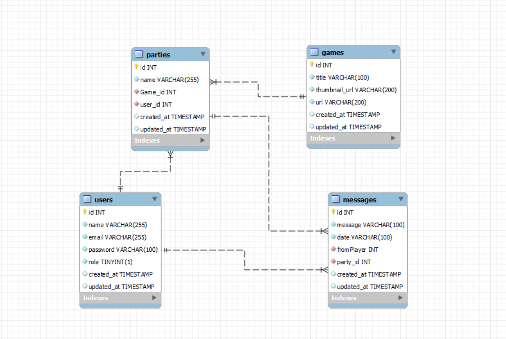
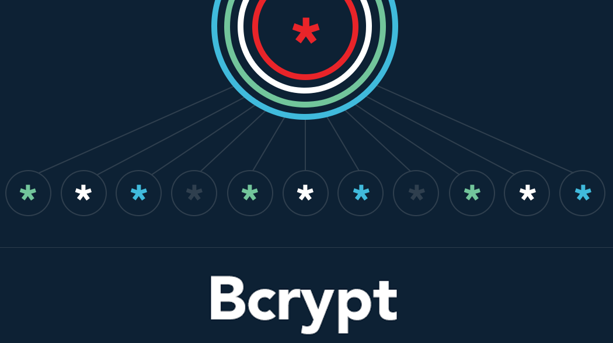
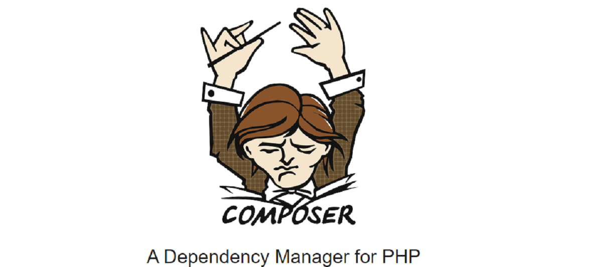
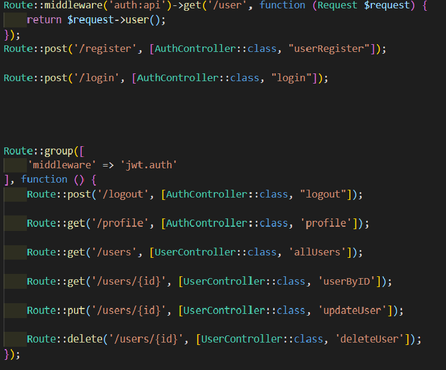
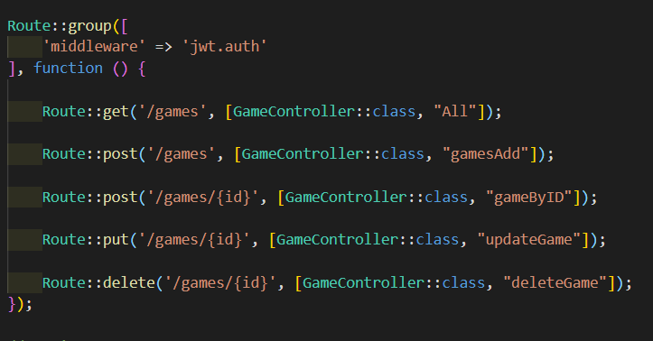
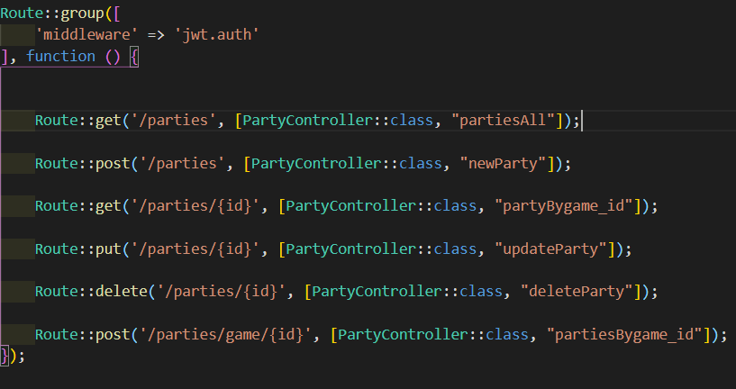
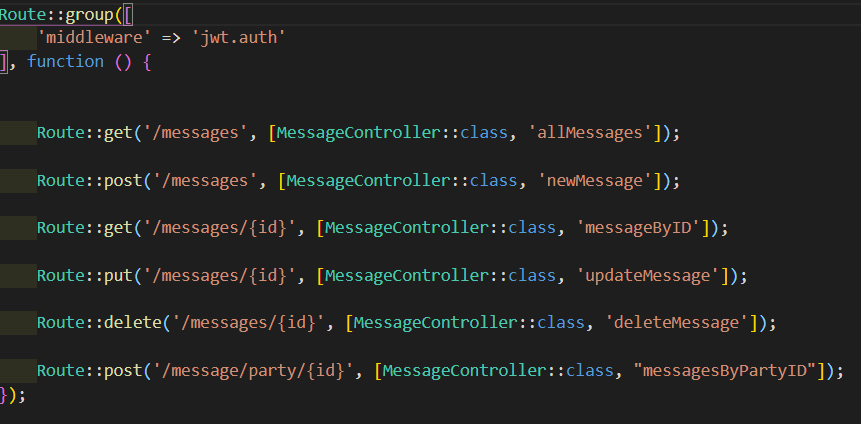

# Proyecto Laravel_PHP

## En que consiste el proyecto:

Consiste en una red social llamada "Discorts" en el que diferentes usuarios podran interactuar entre ellos de manera que podran crear reuniones, llamadas "party" donde podran tratar temas especificos, enviarse mensajes, discutir sobre los videojuegos que posee la plataforma, entre otras cosas.

## Deployado: 

### https://jppl-php-laravel.herokuapp.com/

## Diagrama de relaciones entre las tsablas de la base de datos.

## Instrucciones 

<ol>
    <li>Se requiere tener "composer" instalado en el sistema para poder instalar las dependencias.</li>
    <li>Para instalar de manera local se debe ejecutar el comando php composer install.</li>
    <li>Para usar en una base de datos propia, se debe de cambiar el nombre del archivo .env.example a .env y agregar los datos de la base de datos a utilizar.</li>
    <li>Luego se deberá realizar las migraciones de las tablas con el comando php artisan migrate.</li>
</ol>

## Tecnologias utilizadas.

     

## Postman 

## Endpoints.

### http://localhost:8000/api/ en local
### https://jppl-php-laravel.herokuapp.com/ 

### users.

 
 
### Games.

###  http://localhost:8000/api/games
### https://jppl-php-laravel.herokuapp.com/ 

### Parties.

###  http://localhost:8000/api/parties
### https://jppl-php-laravel.herokuapp.com/ 

### Messages.

### http://localhost:8000/api/messages
### https://jppl-php-laravel.herokuapp.com/ 

(<a href="#top">Volver al inicio</a>)

 
 

